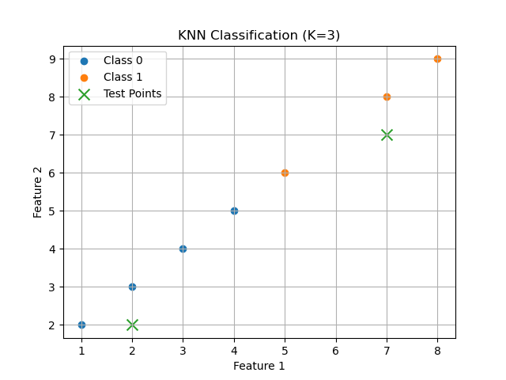

# K-Nearest Neighbors (KNN) from Scratch

This project implements the **K-Nearest Neighbors (KNN)** algorithm from scratch using Python and NumPy, without using any machine learning libraries like scikit-learn.

It demonstrates the core idea behind instance-based learning and distance-based classification.

---

## What is KNN?

K-Nearest Neighbors is a simple supervised learning algorithm used for classification (and regression).

It works by:

* Storing all training data
* Calculating distance between a test point and all training points
* Selecting the **K closest neighbors**
* Predicting the class by majority vote

---

## Formula Used

Euclidean Distance:

$$
  d = \sqrt{\sum_{i=1}^{n}(x_i-y_i)^2}
$$

---

# Project Structure

```text
knn-from-scratch/
├── KNN Plot.png
├── README.md
└── main.py
```

---

# Features

* Pure Python + NumPy implementation
* Data visualization using Matplotlib
* No external ML libraries
* Supports multi-class classification
* Easy to understand and extend
* Beginner-friendly ML project

---

# How It Works

1. Store training dataset
2. For each test sample:

   * Compute distance to all training points
   * Sort distances
   * Pick top K nearest neighbors
3. Return most common class

---

# KNN Visualization

The project also includes a plotting function using Matplotlib to visualize:

* Training points
* Test points
* Class distribution

## Example Plot




---

# Code Implementation

```python
import numpy as np
import matplotlib.pyplot as plt
from collections import Counter


class KNN:

    def __init__(self, k=3):
        self.k = k

    def fit(self, X, y):
        self.X_train = X
        self.y_train = y

    def euclidean_distance(self, x1, x2):
        return np.sqrt(np.sum((x1 - x2) ** 2))

    def predict_single(self, x):

        distances = []

        for x_train in self.X_train:
            distance = self.euclidean_distance(x, x_train)
            distances.append(distance)

        k_indices = np.argsort(distances)[:self.k]

        k_nearest_labels = [self.y_train[i] for i in k_indices]

        most_common = Counter(k_nearest_labels).most_common(1)

        return most_common[0][0]

    def predict(self, X):

        predictions = []

        for x in X:
            prediction = self.predict_single(x)
            predictions.append(prediction)

        return np.array(predictions)

    def plot(self, X_test=None, y_test=None):
        for label in np.unique(self.y_train):

            plt.scatter(
                self.X_train[self.y_train == label][:, 0],
                self.X_train[self.y_train == label][:, 1],
                label=f"Class {label}"
            )

        if X_test is not None:

            plt.scatter(
                X_test[:, 0],
                X_test[:, 1],
                marker="x",
                s=100,
                label="Test Points"
            )

        plt.xlabel("Feature 1")
        plt.ylabel("Feature 2")

        plt.title(f"KNN Classification (K={self.k})")
        plt.legend()
        plt.grid(True)
        plt.show()


if __name__ == "__main__":

    X_train = np.array([
        [1,2],
        [2,3],
        [3,4],
        [4,5],
        [5,6],
        [7,8],
        [8,9]
    ])

    y_train = np.array([0,0,0,0,1,1,1])

    X_test = np.array([
        [2,2],
        [7,7]
    ])

    model = KNN(k=3)

    model.fit(X_train, y_train)

    predictions = model.predict(X_test)

    print(predictions)

    model.plot(X_test)
```

---

# Example Usage

```python
import numpy as np
from main import KNN

X_train = np.array([
    [1,2],
    [2,3],
    [3,4],
    [4,5],
    [5,6],
    [7,8],
    [8,9]
])

y_train = np.array([0,0,0,0,1,1,1])

X_test = np.array([
    [2,2],
    [7,7]
])

model = KNN(k=3)

model.fit(X_train, y_train)

predictions = model.predict(X_test)

print(predictions)

model.plot(X_test)
```

Output:

```text
[0 1]
```

---

# Time Complexity

For each prediction:

* Distance computation → `O(n)`
* Sorting → `O(n log n)`

Overall complexity:

```text
O(n log n)
```

---

# Limitations

* Slow for large datasets
* Sensitive to feature scaling
* Requires storing the full dataset
* No training phase (lazy learning)

---

# Improvements You Can Add

* Weighted KNN
* Feature scaling (Standardization)
* KD-Tree optimization
* KNN regression
* Manhattan distance
* Minkowski distance
* Decision boundary visualization

---

# Why This Project Matters

This project helps you understand:

* Instance-based learning
* Distance metrics
* Decision boundaries
* Lazy learning algorithms
* Core ML fundamentals

It is a strong beginner-friendly machine learning project and a good foundation for understanding real-world ML systems.

---
